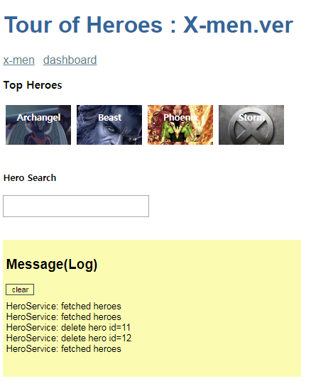
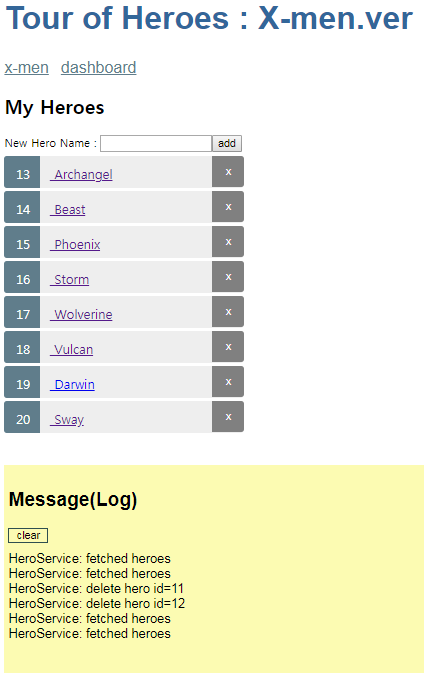

##Tutorial: Tour of Heroes

https://angular.io/tutorial

### Service 

<b>Why services</b>  
Components shouldn't fetch or save data directly and they certainly shouldn't knowingly present fake data. 
They should focus on presenting data and delegate data access to a service.

Services are a great way to share information among classes that don't know each other.

### dashboard (home)

### x-man

